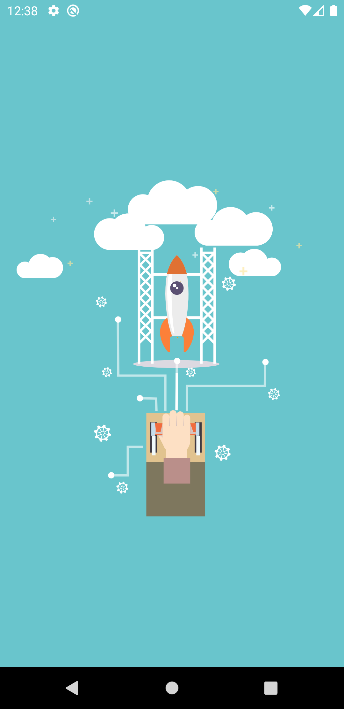
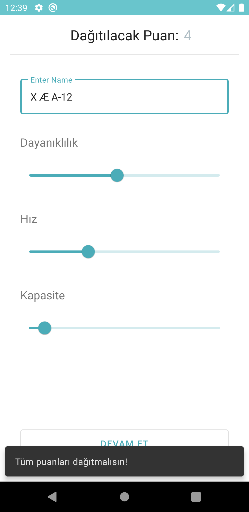
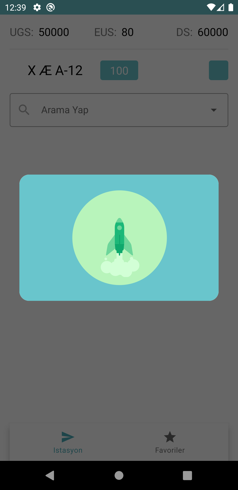
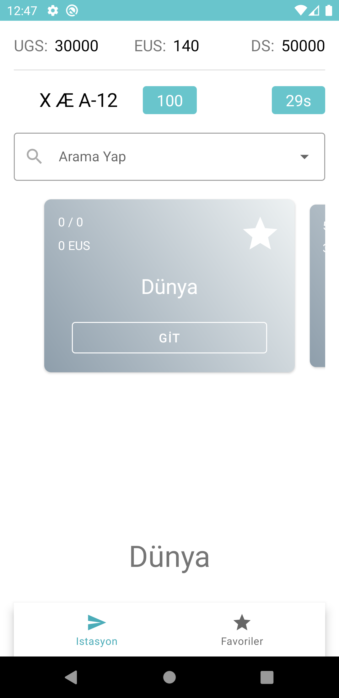
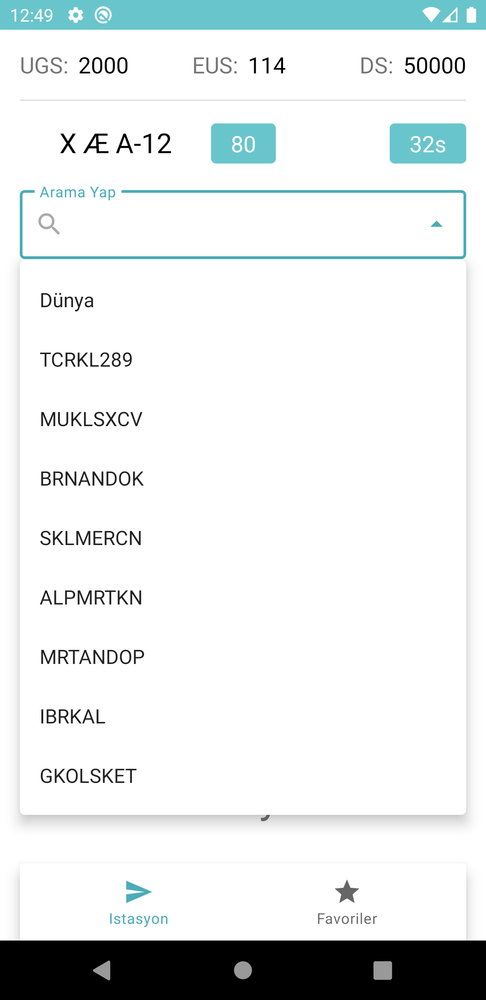
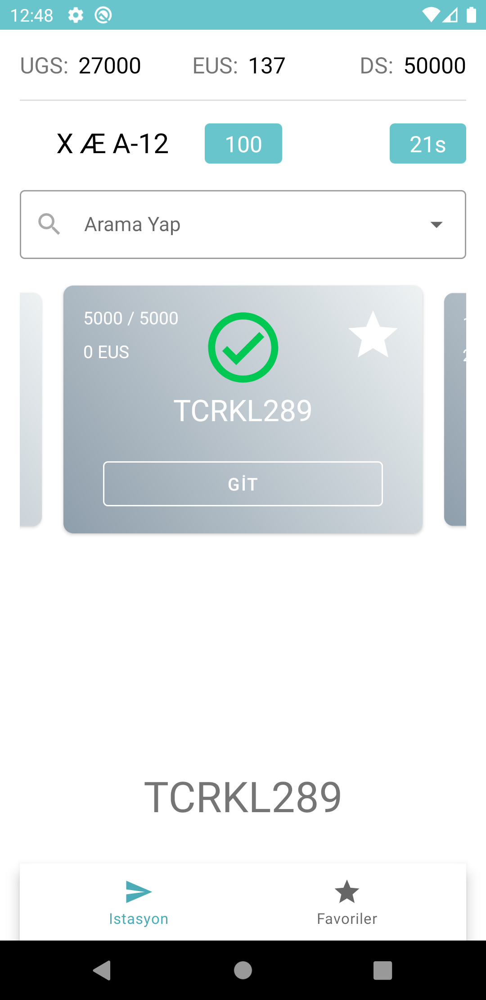
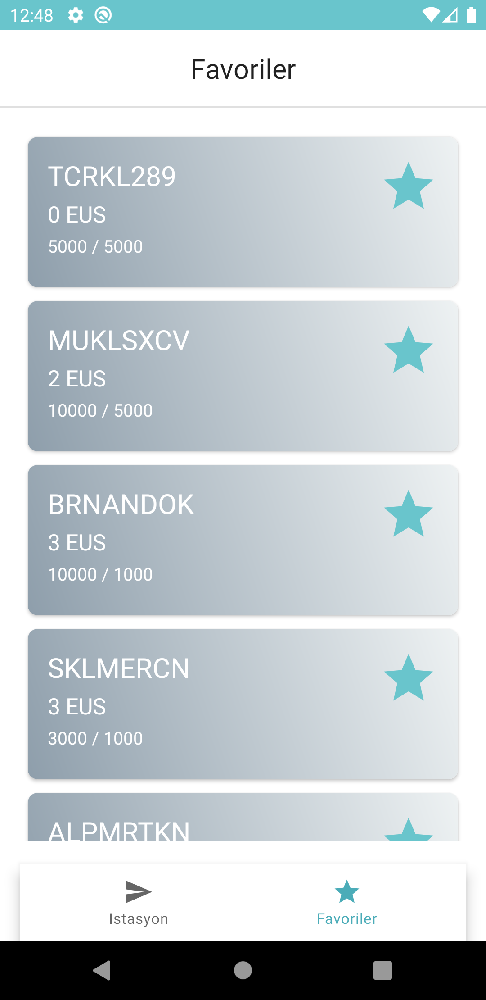
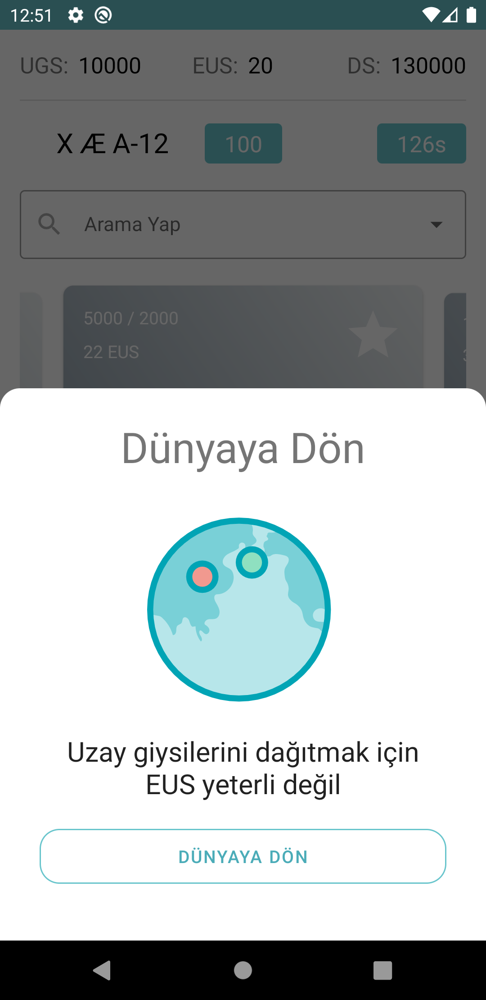
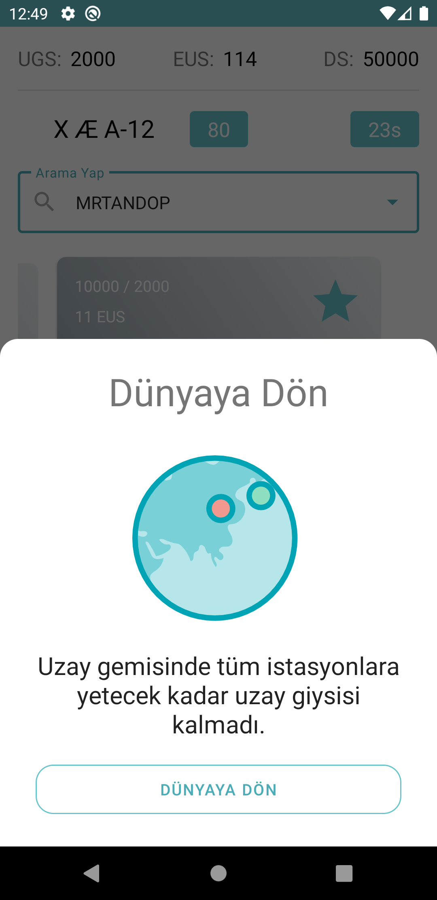
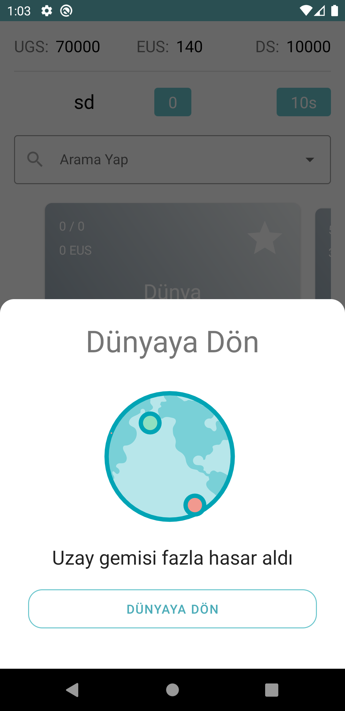

# The Outer Worlds Colony
83b6da4449598ca05b1d33ca104f9ba1

* Android Architecture Components
* Repository Pattern
* MVVM
* Koin(DI)
* Room
* Corountines
* Retrofit
* LiveData
* Kotlin 
* Material Design Guide

## Library Used
* [Android Architecture Components](https://developer.android.com/topic/libraries/architecture/)
* [Live Data](https://developer.android.com/topic/libraries/architecture/livedata)
* [View Model](https://developer.android.com/topic/libraries/architecture/viewmodel)
* [Retrofit](https://square.github.io/retrofit/)
* [Coroutines Overview](https://kotlinlang.org/docs/reference/coroutines-overview.html)
* [Lottie from Airbnb](https://github.com/airbnb/lottie-android)
* [koin DI](https://insert-koin.io/)
* [Material Components](https://material.io/develop/android/docs/getting-started)
* [Carousel](https://github.com/yarolegovich/DiscreteScrollView)
* [Logger from OrhanObut](https://github.com/orhanobut/logger)

## App demo 






```gradle
    implementation "org.jetbrains.kotlin:kotlin-stdlib:$kotlin_version"
    implementation 'androidx.core:core-ktx:1.3.2'
    implementation 'androidx.appcompat:appcompat:1.2.0'
    implementation 'com.google.android.material:material:1.3.0'
    implementation 'androidx.constraintlayout:constraintlayout:2.0.4'
    testImplementation 'junit:junit:4.13.1'
    androidTestImplementation 'androidx.test.ext:junit:1.1.2'
    androidTestImplementation 'androidx.test.espresso:espresso-core:3.3.0'

    // View Model
    implementation "androidx.lifecycle:lifecycle-extensions:2.2.0"
    implementation 'androidx.lifecycle:lifecycle-viewmodel-ktx:2.2.0'

    // Logger
    implementation 'com.orhanobut:logger:2.2.0'

    // Koin for DI
    implementation "org.koin:koin-android:$koin_version"
    implementation "org.koin:koin-androidx-scope:$koin_version"
    implementation "org.koin:koin-android-viewmodel:$koin_version"

    // Testing
    testImplementation "org.koin:koin-test:$koin_version"

    // Lottie
    implementation "com.airbnb.android:lottie:$lottie_version"

    // Material Views
    implementation "com.google.android.material:material:$material_version"

    // Room
    implementation "androidx.room:room-runtime:$room_version"
    kapt "androidx.room:room-compiler:$room_version"
    implementation "androidx.room:room-ktx:$room_version"
    testImplementation "androidx.room:room-testing:$room_version"

    // Retrofit
    implementation "com.squareup.retrofit2:retrofit:$retrofit_version"
    implementation "com.squareup.retrofit2:adapter-rxjava2:$retrofit_version"
    implementation "com.squareup.retrofit2:converter-gson:$retrofit_version"

    // Okhttp
    implementation "com.squareup.okhttp3:okhttp:$okhttp_version"
    implementation "com.squareup.okhttp3:logging-interceptor:$okhttp_version"

    // Livecycle
    implementation "androidx.lifecycle:lifecycle-livedata-ktx:$lifecycle_version"
    implementation "androidx.lifecycle:lifecycle-viewmodel-ktx:$lifecycle_version"

    // Dialog
    implementation 'com.afollestad.material-dialogs:core:3.3.0'
    implementation 'com.afollestad.material-dialogs:bottomsheets:3.3.0'

    // Carousel
    implementation 'com.yarolegovich:discrete-scrollview:1.5.1'
```
